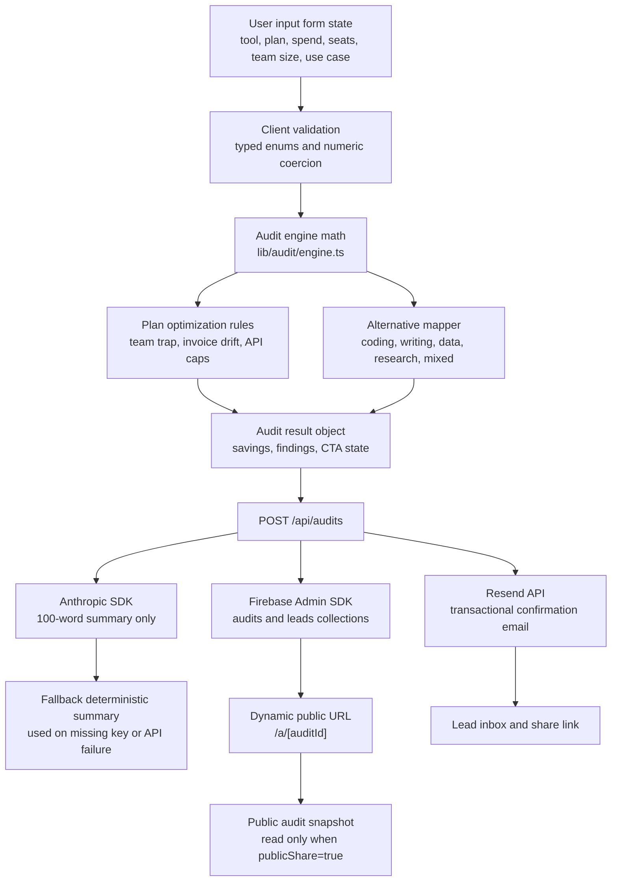

# Architecture

## Product Goal

Credex AI Spend Audit is a lightweight lead-generation product that gives a founder or engineering manager a credible answer in under two minutes: "Are we overspending on AI seats, plans, or API usage?" The app deliberately separates deterministic financial math from AI-generated prose. All savings, thresholds, downgrade logic, and plan comparisons are hardcoded in the audit engine. The Anthropic call only turns those already-computed results into a concise summary.

## System Diagram

## Runtime Components

| Layer | File or directory | Responsibility |
| --- | --- | --- |
| App Router UI | `app/page.tsx`, `components/audit/*` | Collect audit rows, preview deterministic results, and expose a conversion CTA. |
| UI primitives | `components/ui/*` | shadcn-style button, card, input, label, select, and badge primitives. |
| Audit engine | `lib/audit/engine.ts` | Pure TypeScript math. No network calls, secrets, time, random values, or AI. |
| Pricing data | `lib/audit/pricing-data.ts` | Hardcoded retail plan data, source URLs, and cheaper-alternative maps. |
| AI summary | `lib/ai/summary.ts` | Anthropic SDK call with a deterministic fallback. Summary cannot alter savings. |
| Email | `lib/email/resend.ts` | Sends the share URL and short summary via Resend when `RESEND_API_KEY` exists. |
| Firestore | `lib/firebase/server.ts` | Stores audit snapshots and lead records using Firebase Admin credentials from env. |
| Share route | `app/a/[auditId]/page.tsx` | Public report path reserved for saved audit snapshots. |
| Social previews | `app/opengraph-image.tsx`, `app/twitter-image.tsx` | Generated 1200x630 preview cards for screenshot-friendly public links. |
| CI | `.github/workflows/ci.yml` | Runs install, lint, typecheck, unit tests, and build on `main`. |

## Stack Choice

I chose Next.js App Router with TypeScript because the MVP needs both a fast client-side calculator and server routes for saving audits, generating summaries, sending email, and rendering shareable public URLs with Open Graph metadata. Tailwind and shadcn-style primitives keep the UI lightweight enough for the Lighthouse constraints while still producing a polished, screenshot-worthy audit page. Firebase Firestore is a pragmatic backend choice for this assignment because it handles public audit snapshots and private lead records without introducing database hosting, migrations, or an admin panel before the product has demand.

## Data Model

Firestore collections:

| Collection | Document ID | Fields | Access pattern |
| --- | --- | --- | --- |
| `audits` | `auditId` UUID | `createdAt`, `publicShare`, `publicUrl`, `inputs`, `summary`, `totalMonthlySavings`, `audit` | Public read only when `publicShare=true`; writes only through server SDK. |
| `leads` | Auto ID | `createdAt`, `email`, `company`, `auditId`, `publicUrl`, `totalMonthlySavings`, `ctaState` | Server-only. Used for Credex follow-up and funnel reporting. |

The share URL stores no secret material. It should be treated as unlisted, not private. If a future version supports private reports, add authenticated access and signed links rather than guessing privacy from URL entropy.

## Guardrails

No hardcoded secrets are allowed. Firebase, Resend, and Anthropic credentials are read from `.env.local` in development and platform environment variables in production. The app must remain useful when those keys are absent: local preview still runs, the audit engine still returns results, summary generation falls back, and email/storage calls skip safely.

Lighthouse targets are mobile Performance >= 85, Accessibility >= 90, and Best Practices >= 90. The first screen avoids heavy media, third-party scripts, large client libraries, and layout shift. The audit engine is local and pure, so the main interaction does not wait on Firebase, Anthropic, or Resend.

Abuse protection uses a hidden honeypot field plus a small in-memory rate limiter on `POST /api/audits`. That is the lowest-friction option for a post-value lead gate. If the tool gets meaningful launch traffic, the next step is a durable IP/email-domain rate limiter backed by Redis or Firestore TTL documents.

## 10k Audits Per Day Scaling Strategy

10,000 audits/day is roughly 7 audits/minute on average, but the architecture should handle burst traffic from launch posts and founder communities. The first scaling move is to keep deterministic audit math on the client and server as pure CPU work with no database dependency. The POST route should be reserved for saving, emailing, and summary generation after the user asks for the report.

At 10k/day, Firestore can comfortably store audit and lead documents if writes are flat and document IDs are random UUIDs. Avoid sequential IDs and avoid querying unindexed fields. Keep the `audits` document compact by storing normalized inputs, final findings, and summary text, not raw UI event streams. High-volume analytics should go to an event pipeline, not Firestore documents.

Anthropic calls are the main cost and latency risk. Use a short prompt, cap output tokens, cache summaries by a stable hash of normalized audit findings, and skip AI summaries for low-intent anonymous users until they submit email. If Anthropic fails or rate limits, return the fallback summary immediately and queue a retry only for qualified leads.

Resend should be called after Firestore writes succeed. For higher reliability, move email sends to a queue-backed worker such as Cloud Tasks or a Vercel background job so a temporary Resend issue does not fail the audit save.

The production path should use CDN caching for public report pages, server-side validation for all POST bodies, rate limits by IP and email domain, and abuse checks for repeated anonymous audits. The database indexes in `firestore.indexes.json` support lead triage by `createdAt` and `totalMonthlySavings`.
