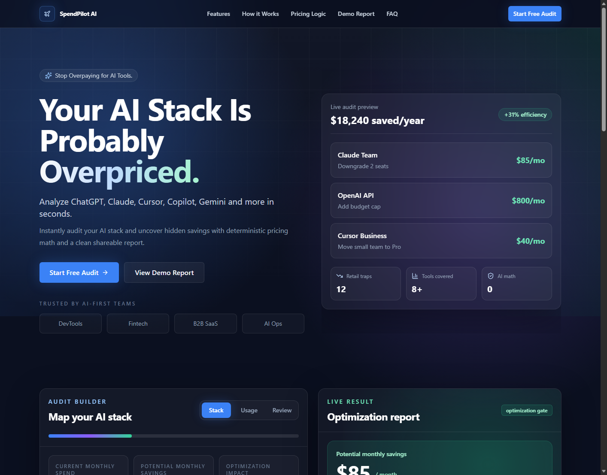
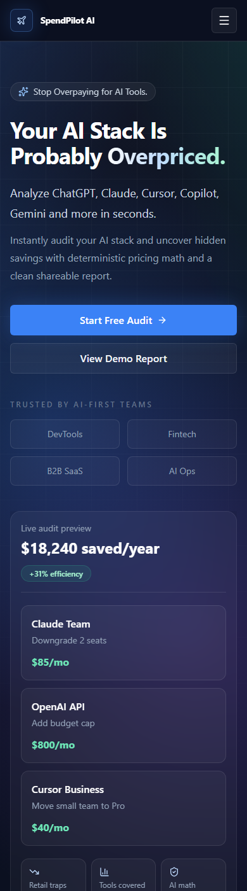
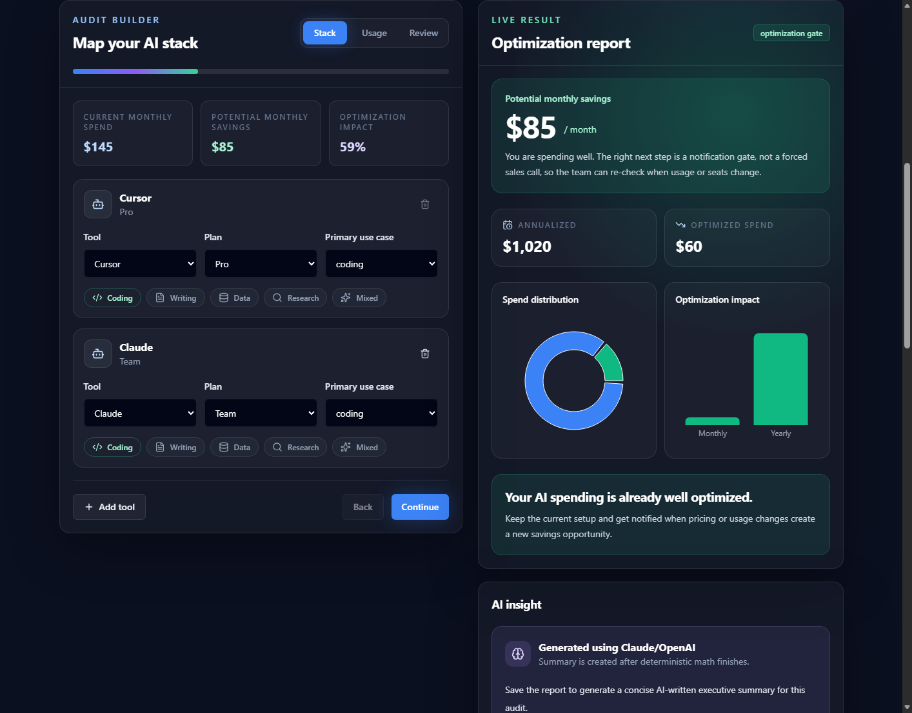
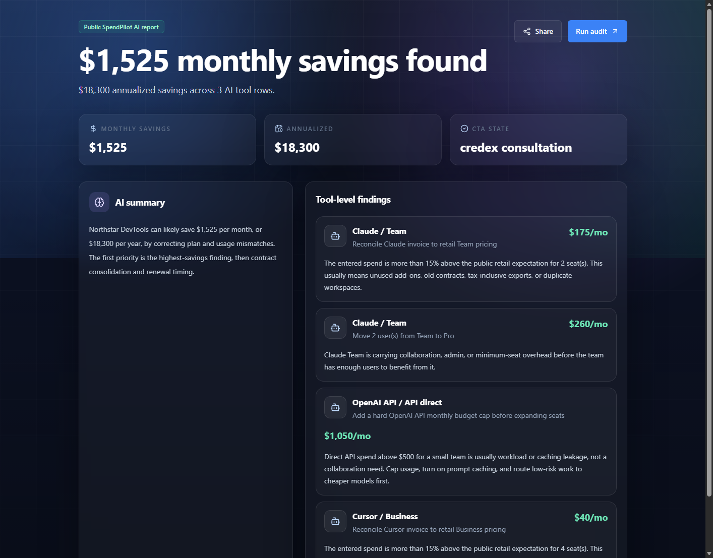

# SpendPilot AI

SpendPilot AI is a free lead-generation web app for startup founders and engineering managers who need to check whether their AI tooling spend is rational before renewal. Users enter AI tools, plans, monthly spend, seats, team size, and use case, then get deterministic savings math, a shareable report URL, and a Credex CTA only when the savings justify it.

Local preview: [http://localhost:3000](http://localhost:3000)  
Deployed URL: [https://you-are-an-expert-full-stack-omega.vercel.app](https://you-are-an-expert-full-stack-omega.vercel.app)

## Screenshots






## Quick Start

```bash
npm install
cp .env.example .env.local
npm run dev
```

Open [http://localhost:3000](http://localhost:3000).

## Environment Variables

```bash
NEXT_PUBLIC_FIREBASE_API_KEY=
NEXT_PUBLIC_FIREBASE_AUTH_DOMAIN=
NEXT_PUBLIC_FIREBASE_PROJECT_ID=
NEXT_PUBLIC_FIREBASE_STORAGE_BUCKET=
NEXT_PUBLIC_FIREBASE_MESSAGING_SENDER_ID=
NEXT_PUBLIC_FIREBASE_APP_ID=

FIREBASE_PROJECT_ID=
FIREBASE_CLIENT_EMAIL=
FIREBASE_PRIVATE_KEY=

ANTHROPIC_API_KEY=
RESEND_API_KEY=
AUDIT_FROM_EMAIL=SpendPilot AI <audits@example.com>
NEXT_PUBLIC_APP_URL=http://localhost:3000
```

## Run Checks

```bash
npm run lint
npm run typecheck
npm run test
npm run build
```

## Deploy

1. Push the repo to GitHub.
2. Import the repo into Vercel.
3. Add every variable from `.env.example` to Vercel project settings.
4. Set `NEXT_PUBLIC_APP_URL` to the deployed domain.
5. Run one production audit and confirm the share URL opens without exposing email, company, or role.

## Decisions

1. **Next.js App Router over a static React app:** the assignment requires public dynamic share URLs and Open Graph previews, so App Router routes and metadata are useful from day one.
2. **Firebase Firestore over a local JSON store:** Firestore gives a real backend quickly and supports public audit snapshots plus private lead records without adding database hosting work.
3. **Hardcoded audit math over LLM reasoning:** the pricing and savings logic must be finance-defensible, so AI only writes the short summary after the audit result is already calculated.
4. **Post-value email capture:** the form shows savings before asking for email because the assignment explicitly says email capture happens after value is shown.
5. **Honeypot plus rate limit over hCaptcha:** this keeps the MVP frictionless for founders while still blocking obvious bot submissions; hCaptcha is a reasonable upgrade if abuse appears after launch.
